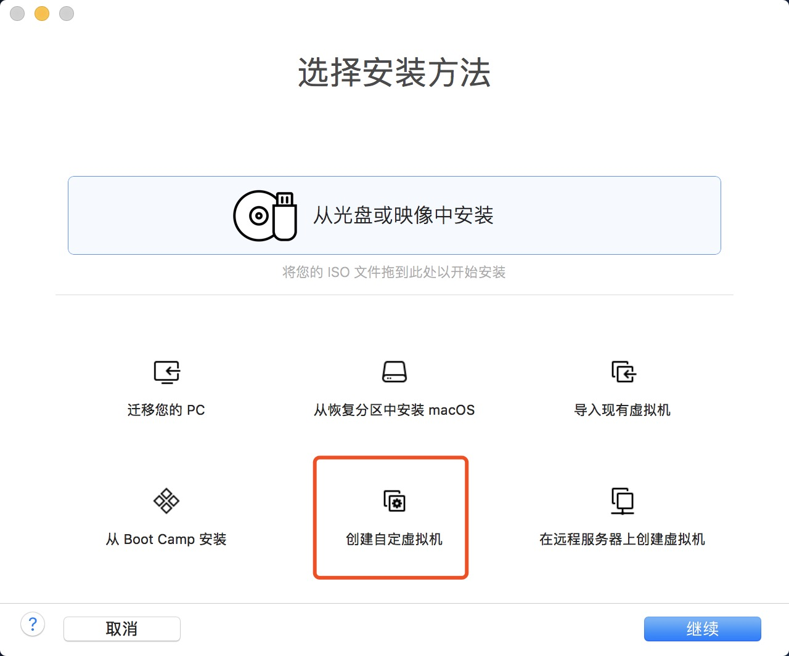
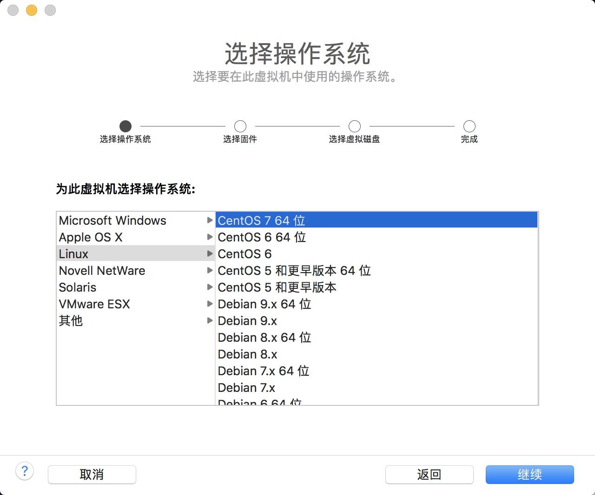
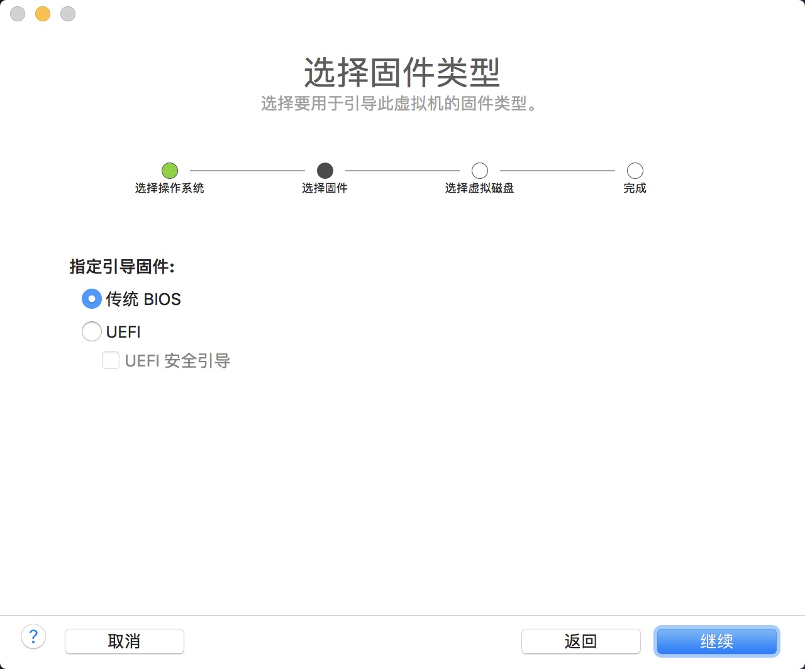
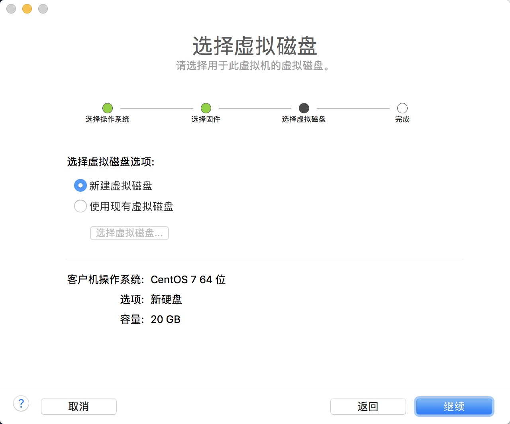
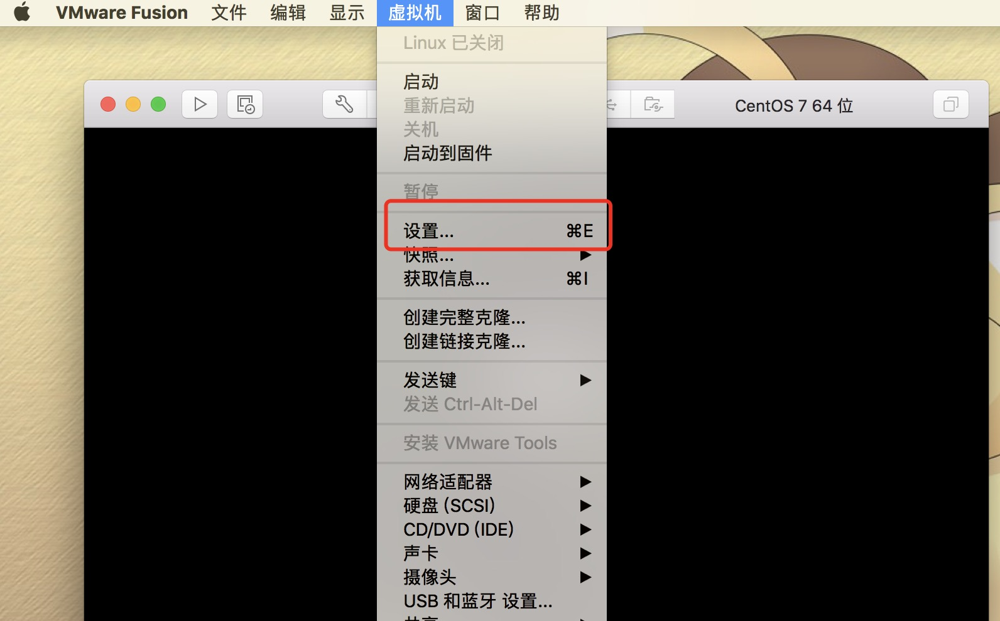
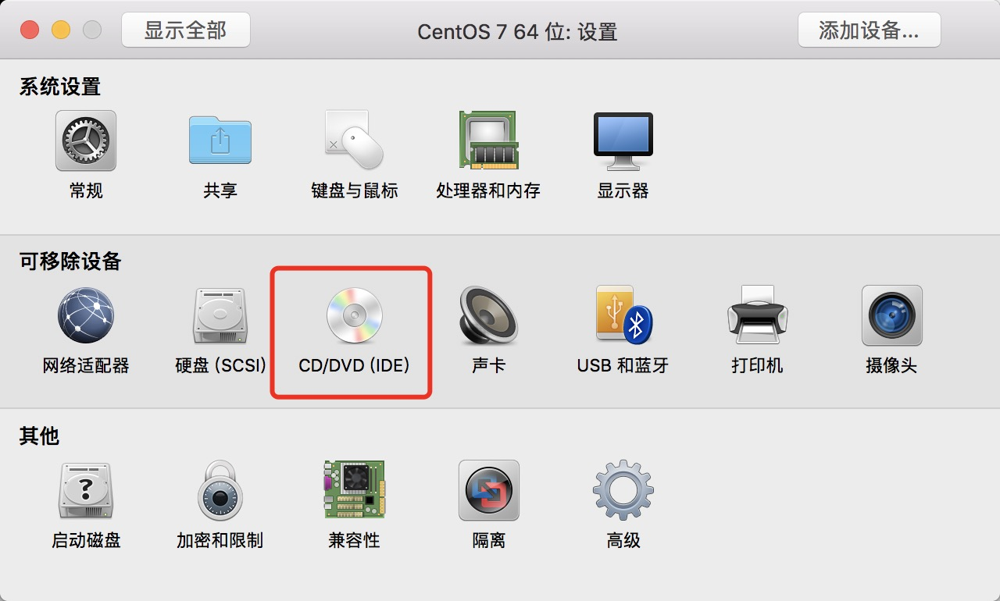
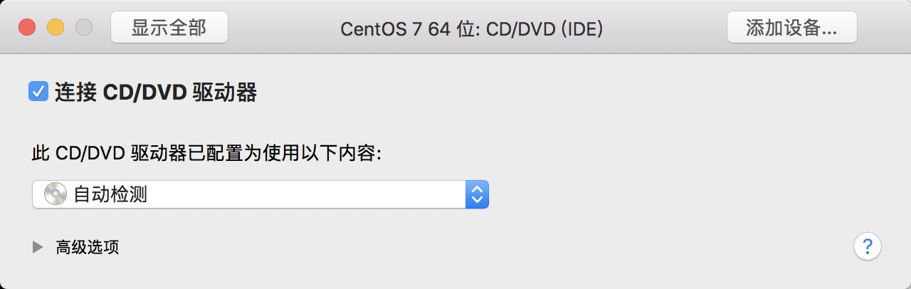
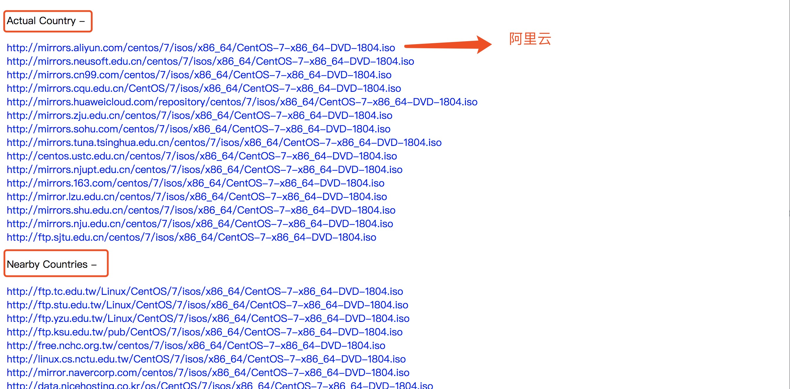

# VMware Fusion 安装CentOS 7 

## 一、新建虚拟机 

1. 选择安装方法-创建自定虚拟机

2. 选择CentOS 7 64位

   

   ​

3. 选择传统BIOS

   

4. 选择新建虚拟盘

   

5.完成

## 二、安装CentOS 7 

1. 点击虚拟机的设置

   

2.点击 CD/DVD 

3.选择DVD镜像

**由于我本机没有CentOS DVD镜像，所以需要下载 （如果已经下载，请移至步骤四）**

## 三、下载CentOS 7 DVD镜像

1.下载地址为 [CentOS/Downloads](https://centos.org/download/)

2.选择DVD ISO

3.优先选择阿里云，搜狐，网易，华为等镜像，下载速度会快些

下载好后，继续从DVD处安装镜像

## 四、安装CentOS 7 系统

