# VMware Fusion 安装CentOS 7 

## 一、新建虚拟机 

1. 选择安装方法-创建自定虚拟机

2. 选择CentOS 7 64位

   

   ​

3. 选择传统BIOS

   

4. 选择新建虚拟盘

   

5.完成

## 二、安装CentOS 7 

1. 点击虚拟机的设置

   

2.点击 CD/DVD 

3.选择DVD镜像

**由于我本机没有CentOS DVD镜像，所以需要下载 （如果已经下载，请移至步骤四）**

## 三、下载CentOS 7 DVD镜像

1.下载地址为 [CentOS/Downloads](https://centos.org/download/)

2.选择DVD ISO

3.优先选择阿里云，搜狐，网易，华为等镜像，下载速度会快些

下载好后，继续从DVD处安装镜像

## 四、安装CentOS 7 系统

1. 下载完成后，即可添加设备

   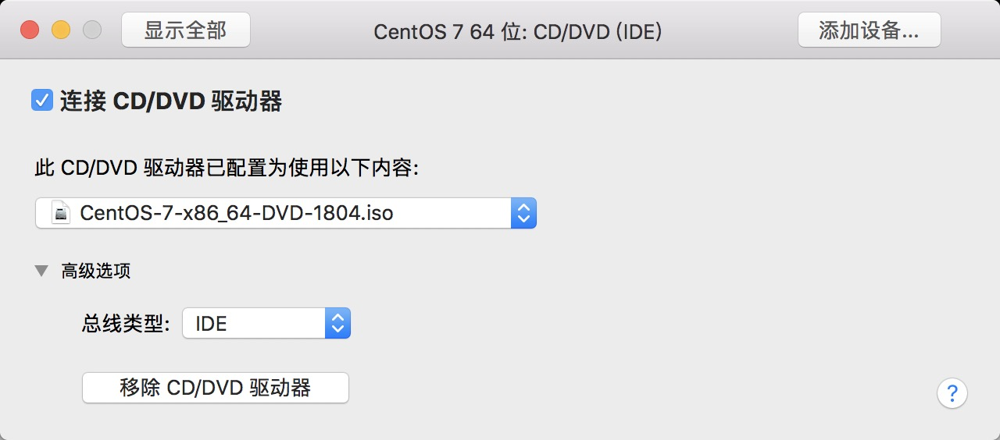

2. 回到设置界面，选择 “启动磁盘”

   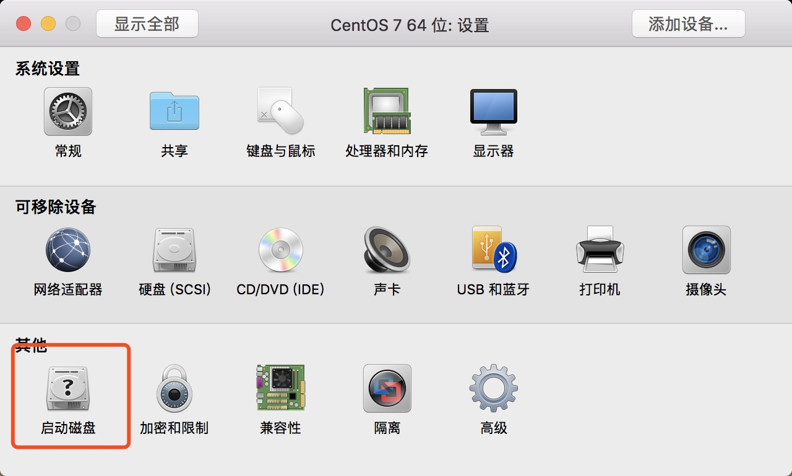

3. 选择DVD后重新启动

   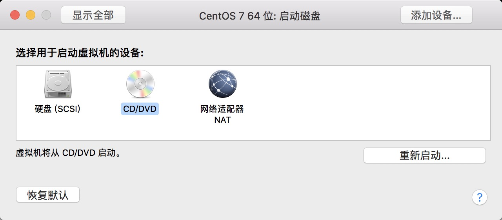

4. 我这里选择的是第二种

   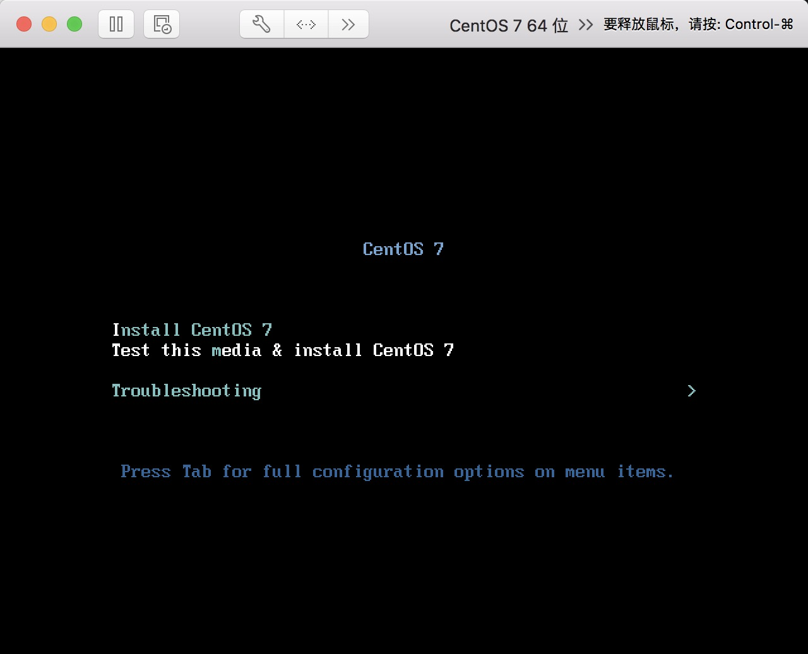

5. 选择语言（英语渣，所以选择了中文。。）

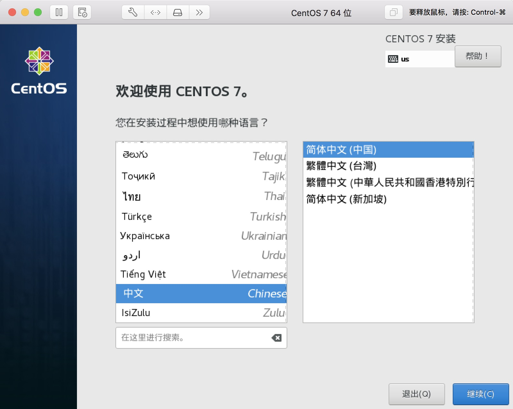

6. 继续 (忘截图了，撸了一张英文图。。。)

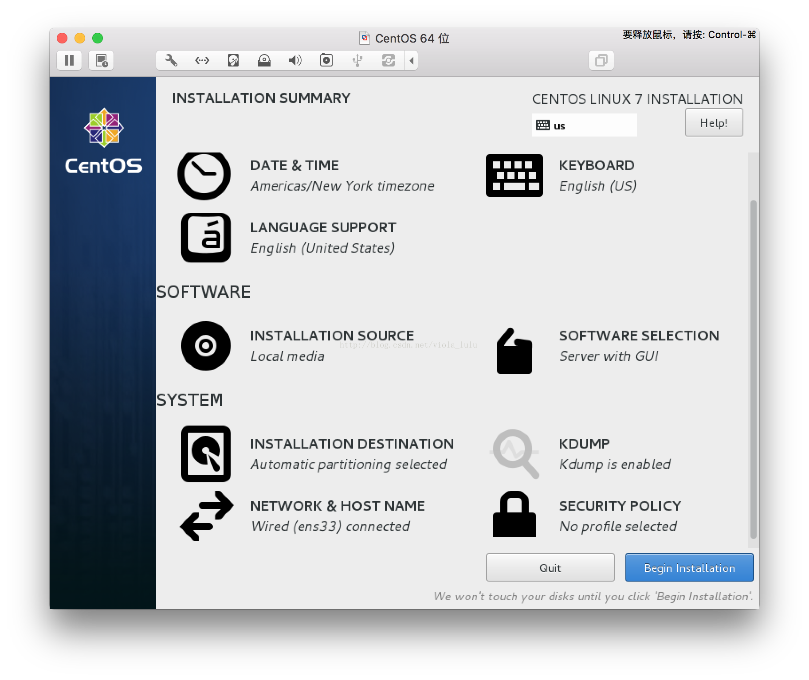 

7. 点击SOFTWARE SELECTION 进入环境选择

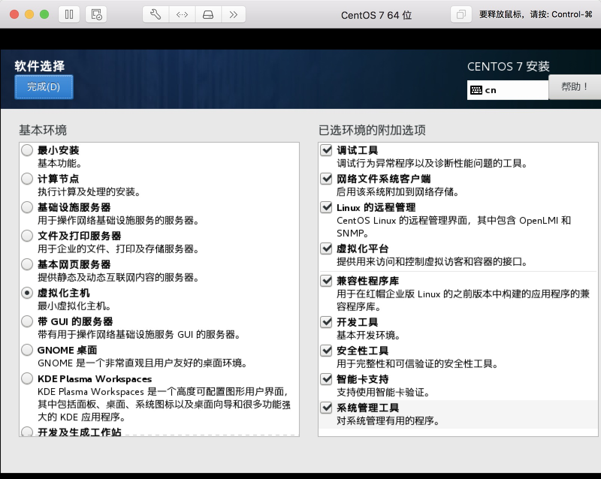

Tips: **默认为最小安装，如果要带有GUI之类的需要自己选择GUI的服务器选项，虽然网上有说最小安装后之后的桌面可以再装，但是会有意料之外的错误，比如Yum没有安装等，由于我只需要使用其中的命令行就OK，所以我选择了虚拟化主机**

8. 点击完成后进入安装目标位置，直接点击完成

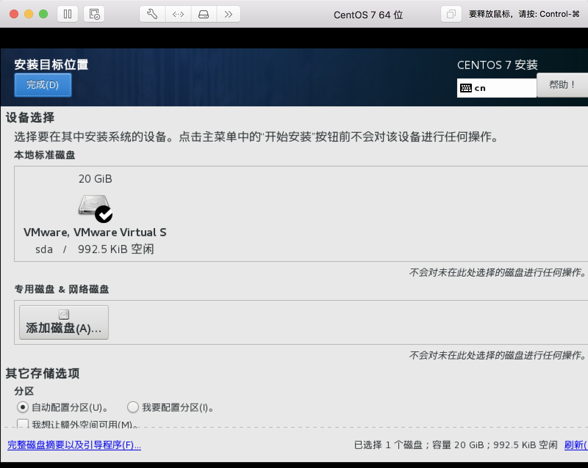

9. 点击网络，打开，然后点击完成

   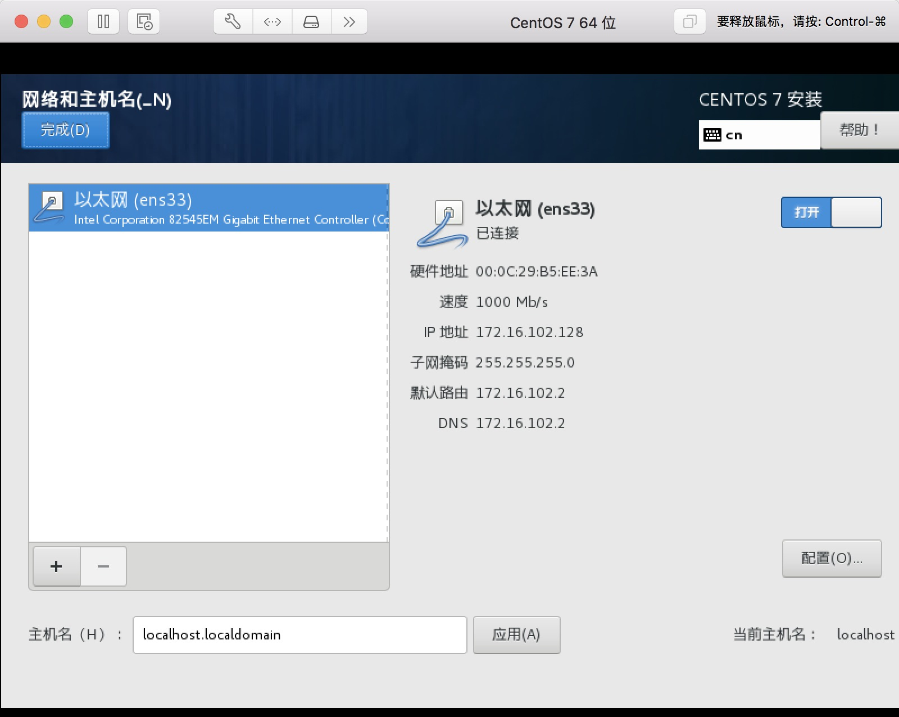

10. 点击开始安装

   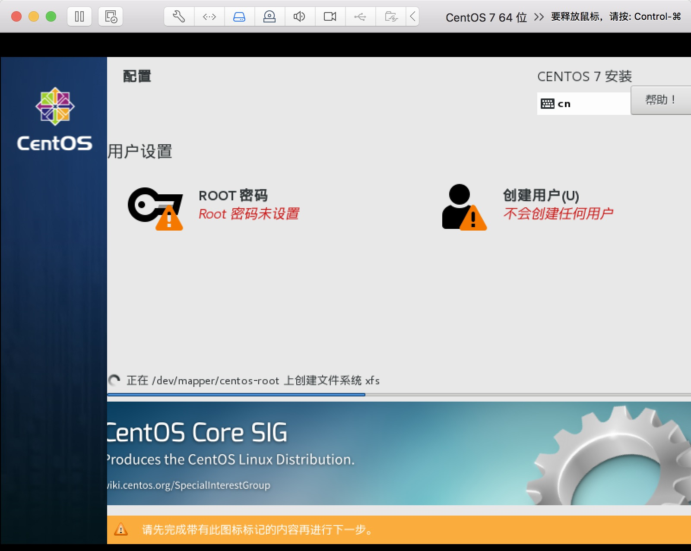

11. 设置ROOT密码

   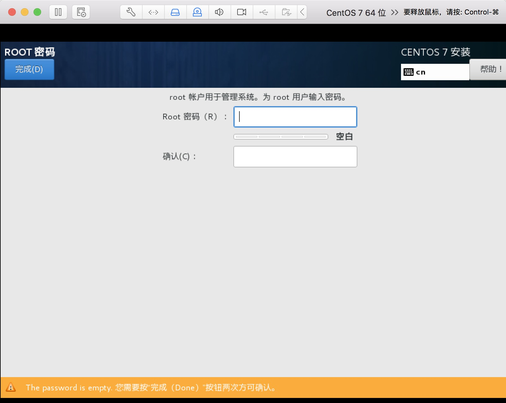

12. 耐心等待安装完成

13. 完成后点击重启

   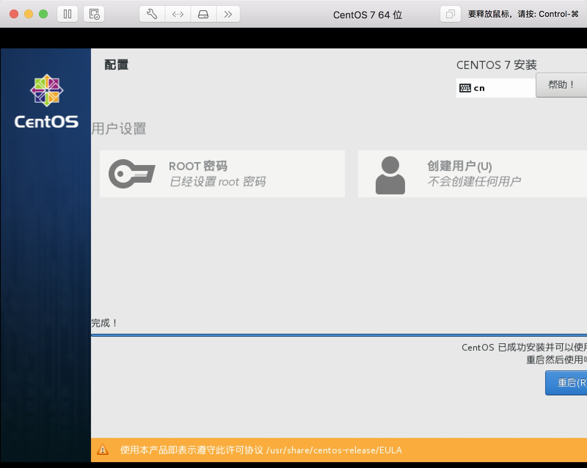

## 五、一些问题

1. 重启后，Ping一下Baidu.com是否联网

   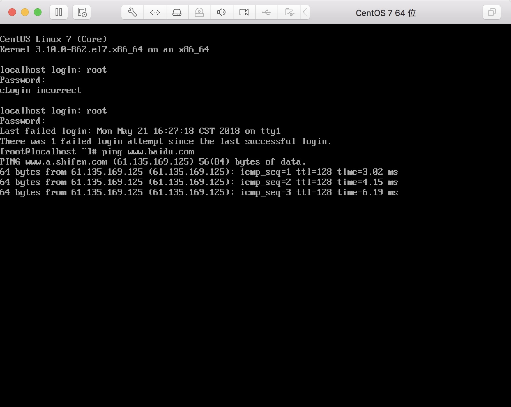

如果无法联网，更改为桥接模式，service network restart。或者关闭虚拟机，重新生成mac地址。一般情况下nat模式即可

2. ifconfig查看Ip 地址后，即可通过ssh访问

   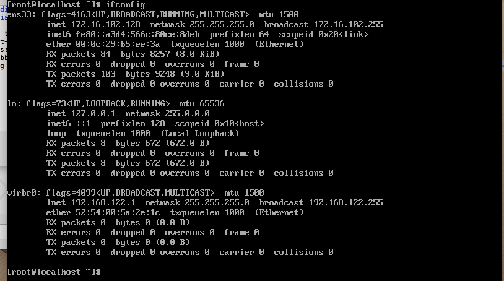