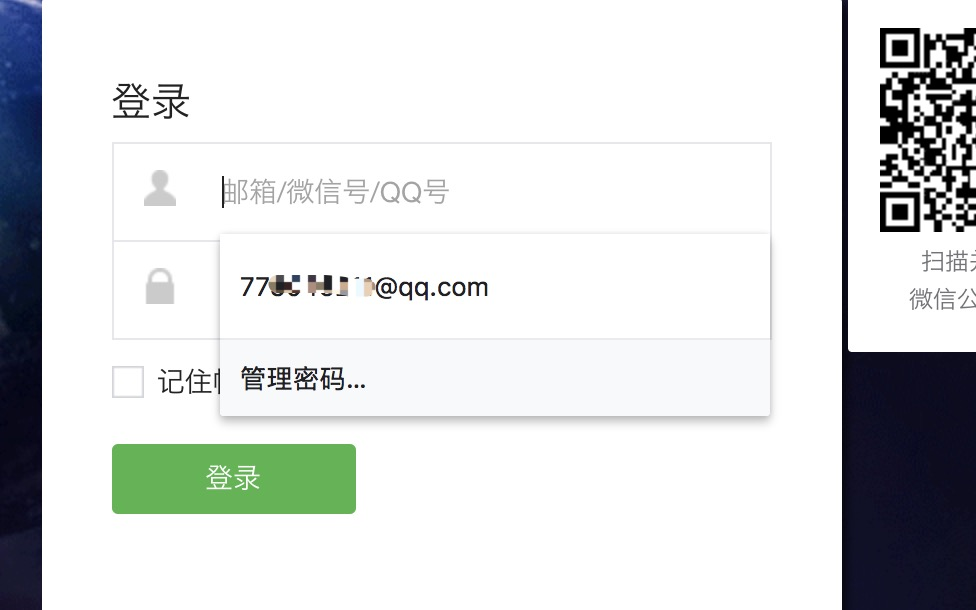
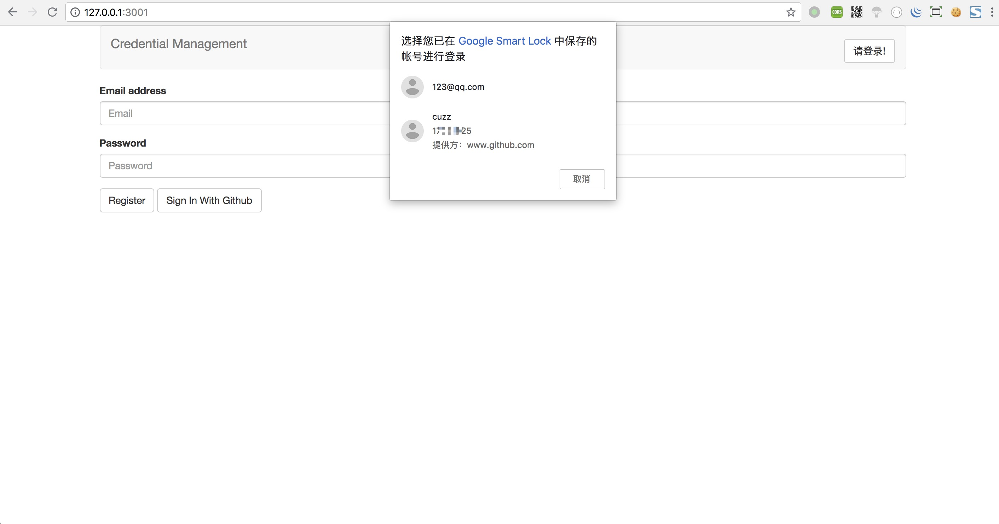
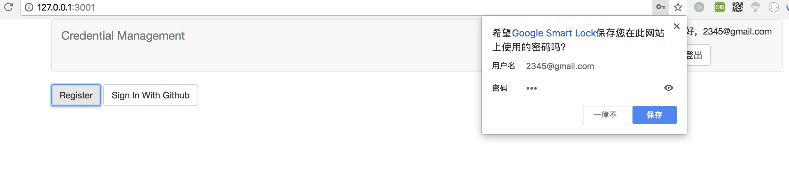
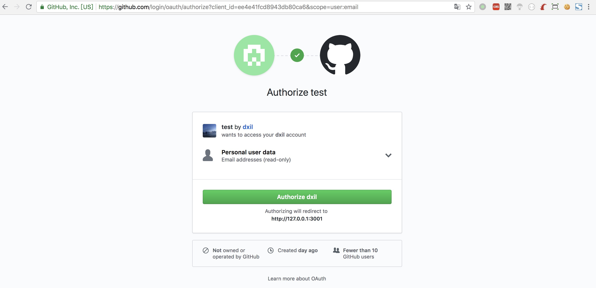
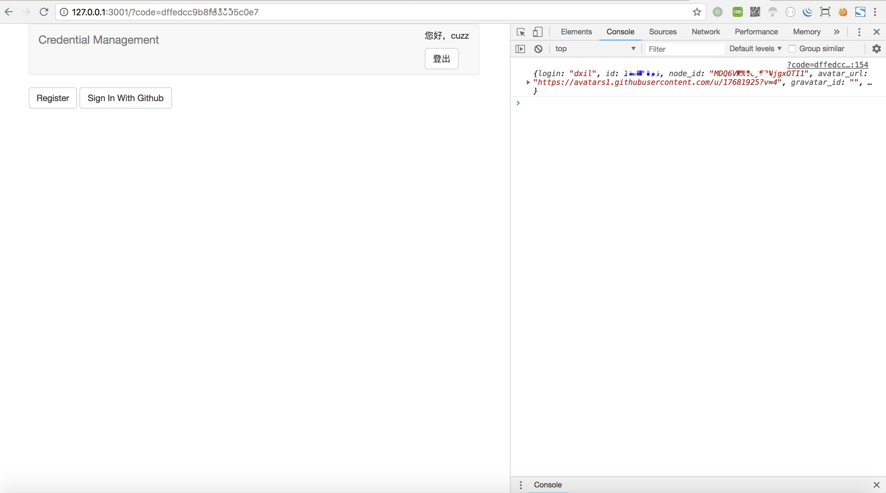
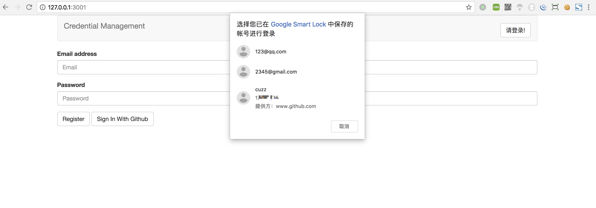

## credential-management API

#### 1、现代浏览器密码管理问题

登录网站的流程一直处于非常麻烦的状态，浏览器用户代理一直在尝试改善登录体验，比如现代浏览器通常能够存储并且自动输入账号密码。

例如在登录某个站点时，会提示自动填充账号



`autocomplete`属性提供了一种声明机制，通过该机制，网站可以与用户代理一起工作，通过将特定字段标记为“用户名”或“密码”来提高后者检测和填写登录表单的能力，尽管浏览器尝试用次优的方法来猜测哪些表单字段应该被填充/存储，但这通常会因为密码更改后，密码管理器无法更新从而导致不一致，甚至有时候是错误的填充行为，具有不常见登录机制的站点（例如，通过`XMLHttpRequest` [[XMLHTTPREQUEST\]](https://w3c.github.io/webappsec-credential-management/#biblio-xmlhttprequest)提交而不是form表单形式的登录）也难以可靠地检测。

另一方面用户希望使用联合身份提供者进行身份验证的情况越来越常见。例如在一些站点通过第三方如微信或微博登录，然而上面这种方式，浏览器无法自动填充联合登录账号的表单。每次都需要输入第三方的账号密码去验证使得流程麻烦。

如果能够使得站点与密码管理器交互，帮助用户代理了解他们选择使用的登录机制，随时更新密码，以及在用户无感知的情况下使用同一身份（包括经过允许的第三方身份）自动登录常登录的站点，那么登录流程将会得到简化

#### 2、credential-management

> 由于查看MDN资料时只有英文文档，于是翻译了MDN的[中文文档](https://developer.mozilla.org/zh-CN/docs/Web/API/Credential_Management_API)

credential-management 旨在简化更改密码的过程，以便客户端上本地存储的密码可以在服务器上进行修改的同时进行更新。并且开发人员能够存储和检索密码凭据和联合凭证。

使用这些 credential-management API，开发人员可以执行以下功能

- 只需轻按一下即可让用户登录。
- 记住用户用于登录的联合帐户。
- 在会话到期时为用户签名。


效果如图：



事先在密码管理器中保存了当前页面的账号密码以及模拟的第三方 **github.com**提供的账号后再次进入该页面，浏览器提示了当前页面有 **123@qq.com** 用户账号密码与第三方**github.com** 提供的账号为 **cuzz** 的用户信息，此时只需选择其中一个账号，来进行获取相应的账号信息，发送到服务端即可登录相应账户，在密码更改后也可以重新改变密码管理器中存储的账号密码，大大简化了登录流程以及解决第三方登录的不可保存问题


#### 3、credential-management API

接下来介绍 credential-management 中常用的几种API：

##### 3.1、navigator.credentials.store() 

当用户使用表单登录您的网站时，您可以使用 [navigator.credentials.store()](https://developer.mozilla.org/en-US/docs/Web/API/CredentialsContainer/store) 来存储凭据。浏览器将提示用户是否存储它。根据凭证的类型，使用[`new PasswordCredential()`](https://developer.mozilla.org/en-US/docs/Web/API/PasswordCredential) 或[`new FederatedCredential()`](https://developer.mozilla.org/en-US/docs/Web/API/FederatedCredential) 创建您要存储的凭证对象。

1. `PasswordCredential ` 类型：

   ```javascript
   let cred = new PasswordCredential({id: data.id, password: '123'})
   ```

   该方法创建一个当前站点的账号密码登录凭证

2. `FederatedCredential  ` 类型：

   ```javascript
   let cred = new FederatedCredential({
     id:       data.id,
     name:     data.name,
     iconURL:  data.iconURL || '',
     provider: data.provider
   });
   ```

   该方法通过传入id和name，以及提供方的站点来创建一个第三方站点的登录凭证

最终

```javascript
navigator.credentials.store(cred) //储存凭证
```

##### 3.2、navigator.credentials.get() 

```javascript
navigator.credentials.get({
      password: true, // `true` to obtain password credentials
      federated: {
        providers: [  // Specify an array of IdP strings
          'https://www.test.com',
          'https://accounts.google.com'
        ]
      },
      mediation: mediation
    }).then(cred => {
      // If credential object is available
      if (!cred) return showError({code: -1, msg: 'did not have Credentials'})

      switch (cred.type) {
        case 'password':
          // If `password` prop doesn't exist, this is Chrome < 60
          if (cred.password === undefined) {
            return showError({code: -1002, msg: 'not support at Chrome version < 60'})

          // Otherwise, this is Chrome => 60
          } else {
            // post cred data
            // return or post data to server
            return Promise.resolve({type: cred.type, cred: cred})
          }
        case 'federated':
          return Promise.resolve({type: cred.type, cred: cred})
        default:
          return showError({code: -1001, msg: 'not support this way sign'})
      }
    })
```

在运行以上代码时，浏览器会检索密码管理器，获取当前页面的账号密码以及第三方账号id，然后呼出上图供用户选择账户。

你可以检查cred中的type来区分是PasswordCredential还是FederatedCredential类型，以便走入普通登录逻辑或者三方登录逻辑。

值得注意的是，在chorme < 60的版本中password不会明文出现，但是由于现在很多网站需要对密码做hash或是密码不一定从表单发出，可能在Json对象中传入，于是在 >60的版本中password将会给到开发人员

另外在chorme 60版本以上

[`requireUserMediation()`改名为`preventSilentAccess()`](https://developers.google.com/web/updates/2017/06/credential-management-updates#preventsilentaccess)

[`navigator.credentials.get()`现在接受枚举`mediation`](https://developers.google.com/web/updates/2017/06/credential-management-updates#mediation) 而不是布尔标志`unmediated`。

[新方法`navigator.credentials.create()`](https://developers.google.com/web/updates/2017/06/credential-management-updates#credentialscreate) 异步创建凭证对象。

##### 3.3、 navigator.credentials.create()

在之前创建密码的方式为

```javascript
let cred = new PasswordCredential({id: data.id, password: '123'});
```

或者

```javascript
let cred = new FederatedCredential({
  id:       data.id,
  name:     data.name,
  iconURL:  data.iconURL || '',
  provider: data.provider
});
```

使用 `navigator.credentials.create()`则接收异步创建密码类型

参考如下代码：

```javascript
let c = await navigator.credentials.create({
  password: {
    id: id,
    password: password
  }
});
let d = await navigator.credentials.create({
  federated: {
    id:       data.id,
    name:     data.name,
    iconURL:  data.iconURL || '',
    provider: data.provider
  }
});
```


##### 3.4、  navigator.credentials.preventSilentAccess()

一般情况下 在` navigator.credentials.get()`中 的`mediation`设置为 `mediation: 'silent'// mediation 有两个值 silent optional`，用户将会静默登录，但不是每个用户都需要自动登录功能，那么调用 `navigator.credentials.preventSilentAccess()`将会取消静默登录

#### 4、子域共享凭据

规范的更高版本允许从不同的子域检索凭证。例如，存储在login.example.com中的密码可用于登录www.example.com。要利用这一点，必须通过调用`CredentialsContainer.store()`显式存储密码。这有时被称为公共后缀列表（PSL）匹配；但是规范仅建议使用PSL来确定凭证的有效范围。它(子域共享凭据)不需要它。因此浏览器的实现可能会有所不同。

#### 5、应用场景

凭据管理的api在对于网站具有多角色登录或者需要第三方oAuth登录流程时能够大大的减轻用户重复输入密码的情况，在封装过后，可以做到网站具有自动登录过程，将用户身份展示出，待用户选择后，再根据选择的账户进行下一步操作。

第一步在用户注册过后，浏览器将会提示是否保存该账号信息



之后登陆密码串中将会提示含有2345@gmail.com账号信息，并且每次修改密码可以调用方法更新，用户将会在下次进入系统时，继续自动以新的密码登录。

在第三方oAuth流程也将变得简单，举Github为例：

在我们普通第三方登陆方式中，由于无法识别用户，每次登陆需要频繁去认证第三方账号



当我们保存住了用户信息在钥匙串中，那么之后登陆如果同样选择了第三方登陆方式，服务端可以将用户信息换取的token去第三方直接获取用户数据，整个流程将会简化。

最终登陆只需选择我们想要的角色与方式即可

oAuth过后拿到的数据：



最终登陆时仅需选择



参考：

>[w3c credential-management规范](https://w3c.github.io/webappsec-credential-management/)
>
>[MDN credential-management API](https://developer.mozilla.org/en-US/docs/Web/API/Credential_Management_API)
>
>[wiki描述](https://en.wikipedia.org/wiki/Credential_Management)
>
>[Streamlining the Sign-in Flow Using Credential Management API - Eiji Kitamura](https://developers.google.com/web/updates/2016/04/credential-management-api)